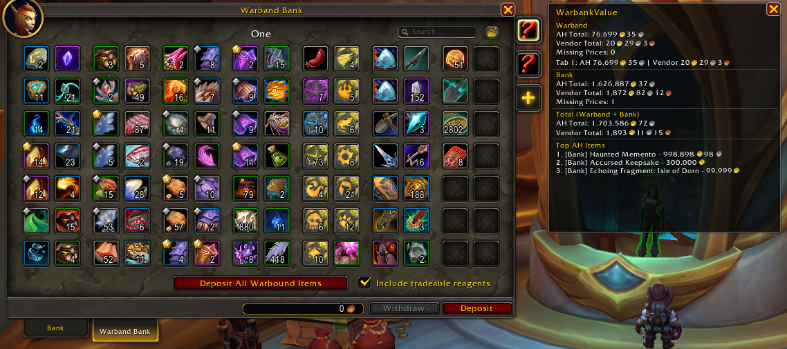

# WarbankValue

> Displays the Auction House and vendor value of items stored in your Warband Bank and regular Bank — at a glance, every time you open the bank.

**Requires [Auctionator](https://www.curseforge.com/wow/addons/auctionator) for AH prices.**

---

## What it does

WarbankValue adds a small, movable summary panel that appears whenever you open your bank. It scans all Warband Bank tabs and your regular Bank slots and shows:

- **AH value** — estimated market value via Auctionator prices
- **Vendor value** — Blizzard sell price for bound and non-auctionable items
- **Bags value** — AH and vendor value of your carried bags (backpack, bags, reagent bag)
- **Per-tab breakdown** — AH and vendor value for each Warband Bank tab
- **Top 3 AH items** — the most valuable auctionable items across all storage, aggregated per item
- **Missing prices** — count of items Auctionator has no price data for yet (shown only when > 0)

Soulbound and Warbound items are correctly excluded from AH valuation and counted at vendor price instead. Items with no AH price also fall back to their vendor price, so the totals always cover everything in the bank. The panel resizes to fit its content, and if Auctionator is missing a notice is shown instead of silent zeros.

## Installation

1. Download and extract the `WarbankValue` folder into your `World of Warcraft/_retail_/Interface/AddOns/` directory
2. Make sure [Auctionator](https://www.curseforge.com/wow/addons/auctionator) is installed — WarbankValue uses its pricing API
3. Reload your UI or log in
4. Open your bank — the summary panel appears automatically

## Slash commands

| Command | Description |
|---|---|
| `/wbv` | Show help |
| `/wbv show` | Show the panel anywhere — Bags scan live, Bank/Warband keep the last scan |
| `/wbv missing` | List items with no Auctionator price data |
| `/wbv resetpos` | Reset the panel position to default |
| `/wbv status` | Show current settings |
| `/wbv debug on\|off` | Toggle debug output |

## Notes

- The panel is **draggable** — position is saved between sessions
- AH prices reflect Auctionator's local scan data; run an Auctionator scan for best accuracy
- Items with no price data are counted as "missing" and listed via `/wbv missing`
- Async item data loading is handled gracefully — the panel refreshes automatically when data arrives

## Compatibility

- **Interface:** 12.1.0 (Midnight)
- **Dependency:** Auctionator (optional but required for AH prices)

## Changelog

### 0.2.0
- New Bags section: AH and vendor value of the carried inventory, included in the Total
- `/wbv show` now rescans on open: Bags are always live; Bank/Warband keep the last scan when the bank is out of reach
- Bank bag IDs now derived from Enum.BagIndex (fixes the carried reagent bag being counted as a bank bag)
- Items without an AH valuation now count at vendor price — totals always cover the whole bank
- Top AH Items aggregated per item instead of per stack
- Panel auto-resizes to fit its content; values right-aligned in a second column
- Missing Prices rows shown only when relevant, highlighted in orange
- Notice shown when Auctionator is not installed
- New `/wbv show` and `/wbv resetpos` commands
- Colored chat output: gold `[WBV]` prefix, accented commands, orange warnings; load message shows the version
- Interface bumped to 12.1.0

### 0.1.0
- Initial release
- Warband Bank and regular Bank scanning
- AH value (via Auctionator) and vendor value display
- Per-tab breakdown, top 3 AH items, missing prices list
- Draggable panel with saved position
- `/wbv` slash commands

---

*Fourth public repo in a series exploring the boundary between human intent and AI execution.*  
*Author: Azareus — [github.com/danilomagro](https://github.com/danilomagro)*
