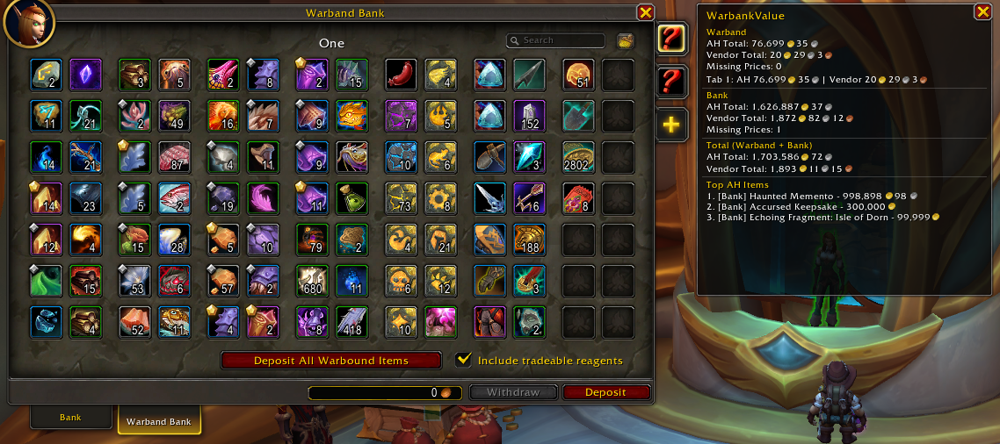
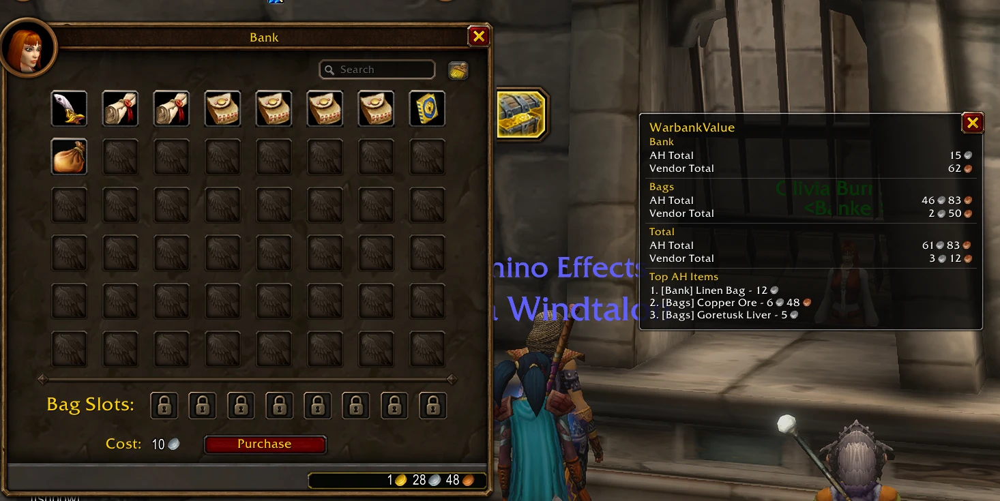

# WarbankValue

> Displays the Auction House and vendor value of everything in your bank and bags — at a glance, every time you open the bank. On Retail it covers your Warband Bank too.

**Requires [Auctionator](https://www.curseforge.com/wow/addons/auctionator) for AH prices.**

---

## What it does

WarbankValue adds a small, movable summary panel that appears whenever you open your bank. It scans your regular Bank slots — and on Retail every Warband Bank tab — and shows:

- **AH value** — estimated market value via Auctionator prices
- **Vendor value** — Blizzard sell price for bound and non-auctionable items
- **Bags value** — AH and vendor value of your carried bags (backpack, bags, reagent bag)
- **Per-tab breakdown** — AH and vendor value for each Warband Bank tab (Retail)
- **Top 3 AH items** — the most valuable auctionable items across all storage, aggregated per item, in quality colors with item tooltips on hover
- **Missing prices** — count of items Auctionator has no price data for yet (shown only when > 0)
- **Minimap button** — click to toggle the panel, hover for live AH/vendor totals, drag to set both its angle and its distance from the minimap

Soulbound items (and, on Retail, Warbound items) are correctly excluded from AH valuation and counted at vendor price instead. Items with no AH price also fall back to their vendor price, so the totals always cover everything in the bank. The panel resizes to fit its content, and if Auctionator is missing a notice is shown instead of silent zeros.

## Retail and WoW: Forever

WarbankValue runs on both games, each loading its own TOC file. WoW: Forever has no Warband Bank, so there the panel covers your bank and bags, and the Warband section simply does not appear.

| | Retail | WoW: Forever |
|---|---|---|
| Regular Bank | Yes | Yes |
| Bags | Yes | Yes |
| Warband Bank, per-tab breakdown | Yes | No - the game has no Warband Bank |
| Latest file on CurseForge | 0.1.0 (0.2.0 once tested on Retail) | 0.2.0 |

## Installation

1. Download and extract the `WarbankValue` folder into your game's `Interface/AddOns/` directory (`_retail_` for Retail, `_classic_beta_` for the WoW: Forever beta)
2. Make sure [Auctionator](https://www.curseforge.com/wow/addons/auctionator) is installed — WarbankValue uses its pricing API
3. Reload your UI or log in
4. Open your bank — the summary panel appears automatically

## Slash commands

| Command | Description |
|---|---|
| `/wbv` | Show help |
| `/wbv show` | Show the panel anywhere — Bags scan live, Bank/Warband keep the last scan |
| `/wbv missing` | List items with no Auctionator price data |
| `/wbv resetpos` | Reset the panel and minimap button positions |
| `/wbv minimap on\|off` | Show or hide the minimap button |
| `/wbv status` | Show current settings |
| `/wbv debug on\|off` | Toggle debug output |

## Notes

- The panel is **draggable** — position is saved between sessions
- AH prices reflect Auctionator's local scan data; run an Auctionator scan for best accuracy
- Items with no price data are counted as "missing" and listed via `/wbv missing`
- Async item data loading is handled gracefully — the panel refreshes automatically when data arrives

## Compatibility

- **Interface:** 12.1.0 (Midnight, Retail) and 16001 (WoW: Forever, game version 1.60.1)
- **Dependency:** Auctionator (optional but required for AH prices)

## Changelog

See [CHANGELOG.md](CHANGELOG.md). The release workflow publishes it as the CurseForge changelog of each file.

---

*Fourth public repo in a series exploring the boundary between human intent and AI execution.*  
*Author: Azareus — [github.com/danilomagro](https://github.com/danilomagro)*
